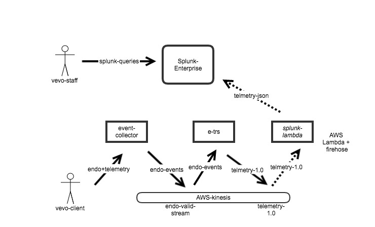

e-trs

Endo cusom-event Reporting Service, e-trs provides capability for clients to transmit and query custom-events data.  Client platforms, such as android, web, ios, will utilize: 
* endo to transmit custom event data
* Splunk to query for the custom-events related data

## Summary
e-trs is a scala utility to:
- streams endo events from kinesis stream 
- filters for for custom-events payloads
- publishes the valid endo-custom-events data to the kinesis stream, telmetry-1.0, for downstream processing

The downstream processing consist of an AWS lambda that:
    {
- pulls from telmetry-1.0 stream
- pushes telmetry events to splunk enterprise services

Clients utilizing endo events may provide telmetry related data.

## Detail

To trasmit telmetry related data utlize endo.eventRouter
- noun, location is
  - noun is any valid noun
  - location is any valid location

- opts is the custom event JSON with as folow:

```Json
     {
      "custom": {
        "android-key1": "val-1",
        "android-key2": "val-1",
        "android-key3": {
          "inner-key1": "inner-val-1",
          "inner-key2array": [
            "v001",
            "v002",
            "v003"
          ]
        }
      }
    {
```

## About Kinesis - Splunk  flow

Endo-telmetry data is pushed from kinesis to Splunk Http Event Collector,  HEC, via [e-trs-splunk-lambda](https://console.aws.amazon.com/lambda/home?region=us-east-1#/functions/e-trs-splunk-lambda?tab=code) The following are dev related URLs:

- [e-trs-splunk-lambda](https://console.aws.amazon.com/lambda/home?region=us-east-1#/functions/e-trs-splunk-lambda?tab=code)
- [splunk HEC configuration](https://prd-p-xshtn2lq6jj6.cloud.splunk.com/en-US/manager/search/http-eventcollector)
- [splunk search](https://prd-p-xshtn2lq6jj6.cloud.splunk.com/en-US/app/search/search?earliest=-15m&latest=now&q=search%20index%3D*&display.page.search.mode=verbose&dispatch.sample_ratio=1&sid=1493782334.142)


## Splunk setup and configurations
[Splunk-configuration](./splunk-setup.md)

## Splunk search
A sample Splunk search:
```
index=* sourcetype=_json| spath "telemetry.android-key1" | search "telemetry.android-key1"=val-1
```
This sample search will result :
```
{
  "endo": {
    "event_id": "35052462-9ee4-449e-aac2-052c02cf16c2",
    "metadata": {
      "event_type": "endo-1.0",
      "app_name": "event-collector",
      "app_version": "2.1.0",
      "build_number": "1",
      "timestamp": 1493834704263
    },
    "device_context": {
      "syn_id": "bb8a16ab-1279-4f17-969b-1dba5eb60eda",
      "user_id": "33758726",
      "build_number": "407-b119",
      "referrer": "",
      "radio_type": "unknown",
      "platform": "android",
      "_site": "vevo-prod",
      "device": "a-top-screte-android-device",
      "anon_id": "118091917",
      "app_version": "0.3",
      "resolution": "3008x1692"
    },
    "sent_at": 1493422091714
  },
  "custom": {
    "android-key1": "val-1",
    "android-key3": {
      "inner-key2array": [
        "v001",
        "v002",
        "v003"
      ],
      "inner-key1": "inner-val-1"
    },
    "android-key2": "val-1"
  },
  "awsRequestId": "04eaadbb-9364-4561-bac8-af4fa4847d4d"
}
```
### Requirements
* JDK 1.8 +
* Scala 2.11.9+
* Scalaz 2.7.2
* sbt 13.13
* docker

### Anatomy of project packages:

- model: domain model & JSON protocol converters
- api: this package contins http related stuff. At this time we only supprt status reporting
- kcl:  kinesis and streaming related code
- svc: service layer that disseminates stream products to multiple sinks
- utils: implicits, threading model, converters, applicatives

### setup
```
git clone https://github.com/VEVO/e-trs
sbt clean compile  // to build prject
sbt test // unit test
sbt clean compile universal:packageBin // to generate an executable
sbt clean compile docker:publishLocal
```

### References

[datadog](http://docs.datadoghq.com/api/#metrics-post)

[kinesis KPL](http://docs.aws.amazon.com/streams/latest/dev/kinesis-kpl-config.html)

[kubernetes](http://docs.aws.amazon.com/streams/latest/dev/kinesis-kpl-config.html)

[scalaz](https://github.com/scalaz/scalaz)

[crice](https://circe.github.io/circe/)

[http4s](https://github.com/http4s/http4s)

[cats typelevel](http://typelevel.org/cats/)

[splunk](http://docs.splunk.com/Documentation)
